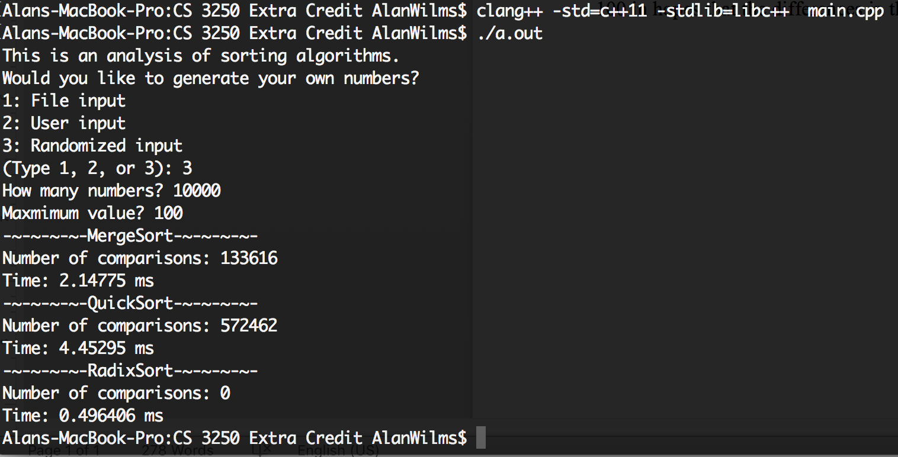
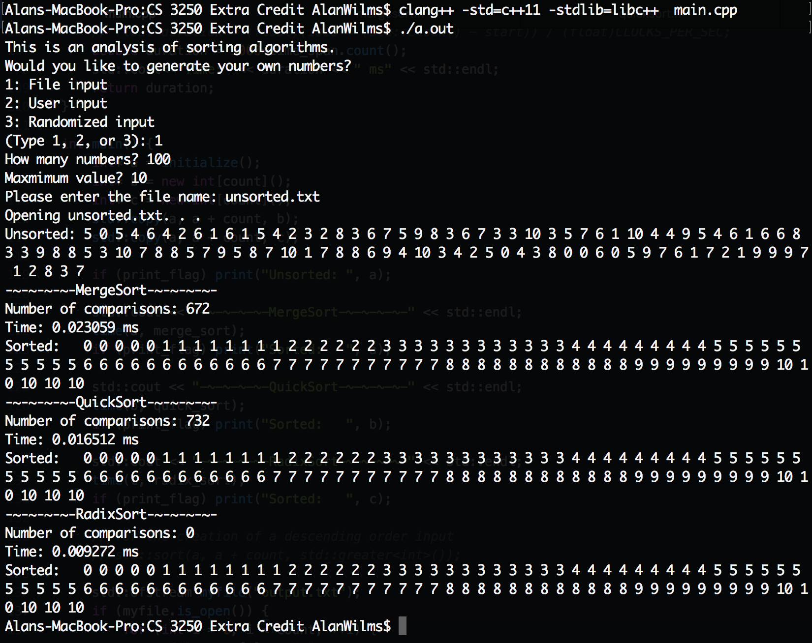
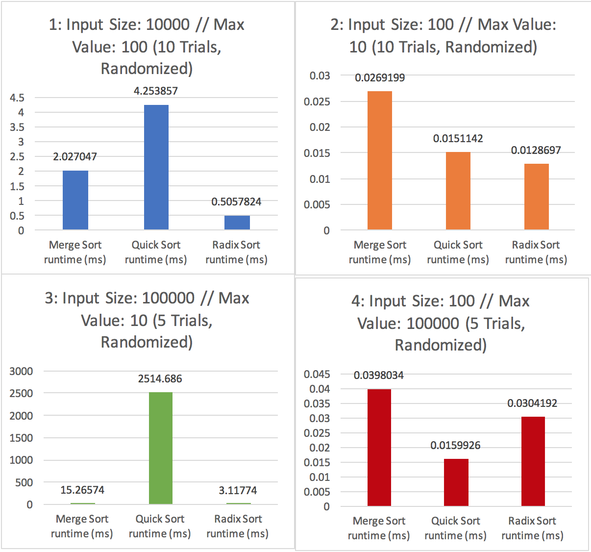
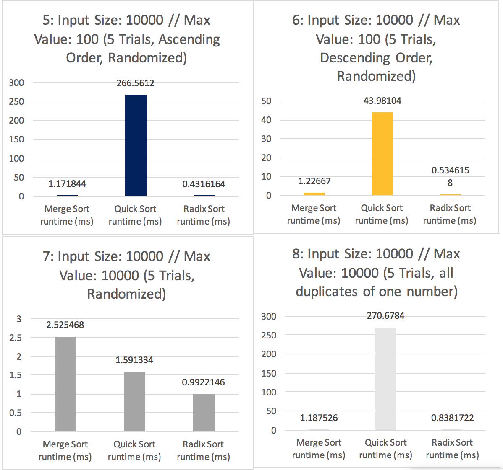

# ExtraCredit: Sorting Algorithms Analysis

Alan Wilms
alan.wilms@vanderbilt.edu
CS 3250
Fall 2017

## Goal:

The goal was to write a radix sort program that takes as input a set of numbers, and a value max to indicate the largest value in the set. The program needs to choose a base for doing radix sort based on max. Furthermore, at least two other expected case O(nlogn) algorithms should be programmed. A set of data, including some that I would expect radix sort to perform well or poorly, is run through each algorithm and the results compared.

## Methodology:

I wrote a program (see the attached code) that took in an unsorted integer array in one of three ways: via a file, via the terminal, or via random generation. Procedures are in place to guard against incorrect inputs such that the user is met with another prompt. Regardless, the user must enter the max value of the input (could easily be analyzed but I wanted finer granularity for the radix sort experimentation) and the size of the input.

The program creates two additional copies of the unsorted array and runs a merge sort, quick sort, and finally the radix sort. The merge sort used is the standard algorithm while the quick sort uses a random partition to improve the expected worst-case runtime to match that of the expected case. Note that that we are performing the radix sort with bases of 10, ie it creates 10 buckets (one for each integer digit) for sorting each decimal place. The number of comparisons and very detailed run time in milliseconds are printed out for each. Lastly, the sorted array is written to an output file for an easy way to create sorted inputs.

To test general expected cases, I ran my program 10 times for an input of size 100 and a max input value of size 10. I did the same for an input size of 10000 and a max input value of size 100 in hopes that the differences in the runtimes would become more apparent.
Additionally, I ran the program on arrays of 10000 integers in both ascending and descending sorted order.

All of the data in aforementioned trials were then graphed and analyzed.

## Results:

The six major trials are as follows:
* input size: 10000, max value: 100, randomized
* input size: 100, max value: 10, randomized
*	input size 100000, max value: 10, randomized
* input size 100, max value: 100000, randomized
* input size 10000, max value: 100, descending order

The randomized unsorted input array provided a good benchmark for the expected case, especially when averaged over 5 or 10 trials. One of the main takeaways is that radix sort performed generally better than both merge and quick sort in almost every case – as is expected for a O(n) sorting algorithm compared with the O(nlogn) runtime of the others, with one major exception. Radix sort performs rather poorly with a trial with a very large maximum value (and a relatively small input size). This is to be expected because this would create many unnecessary buckets for each comparison sort (in this case 50 total buckets for only 100 input numbers). In experiment 4, for example, the quick sort algorithm actually ran 2 times as fast.

On the other hand, the radix sort does particularly well in the opposite case, when a large unsorted input array is constrained to a relatively low maximum value (such as experiment 1 with an input size of 10000 but max value of 100). In this case, having 20 total buckets for 10000 elements is very efficient, and this shows. In experiment 1, radix sort algorithm ran 4 times and 8 times as fast as merge sort and quick sort, respectively, which are non-trivial improvements.

As expected, the ascending or descending tendency of the input data has no significant effect on the performance of radix sort, as demonstrated by experiment 5 and 6 that both had similar runtimes. Also, radix sort is equally effective with monolithic data sets that contain only one duplicated element. This is thanks to its non-comparison aspect.

Beyond the radix sort observations, it seems as though quick sort struggles with larger input sizes. But on further analysis, quick sort seems to be particularly constrained when the pivot element occurs many times (as would be the case in experiments 1, 3, 5, 6, and especially 8). This is because of the line condition arr[j] <= pivot that becomes true each time you encounter an element that is the same as the pivot element, leading to many unnecessary swamps in some cases. This can be shown by the number of comparisons that was also recorded by the program. The quick sort algorithm in experiment had more than 4 times the number of comparisons made as merge sort. This number jumps to a ridiculous 270 times in experiment 3.

Merge sort was consistent and, while was outperformed by radix sort in all but one case, it was still largely effective and likewise unfazed by the ascending/descending tendency and most size changes.

See the attached spreadsheet for the full trial data. 

## Conclusion:

Radix sort performs well generally. It performs especially well for extremely large input sizes that are constrained to a small maximum value. On the other hand, this algorithm struggles with a maximum value that is much larger than its input size due to the unused many buckets created in the counting sort implementation.

### 1: Input Size: 10000 // Max Value: 100 (10 Trials, Randomized) ###
Trial | Merge Sort runtime (ms) | Quick Sort runtime (ms) | Radix Sort runtime (ms) | MS comparisons | QS comparisons
----- | ----------------------- | ------------------------| ----------------------- | -------------- | --------------
1	| 2.14775	| 4.45295	| 0.496406	| 133616	| 572462
3 | 2.08252 | 4.06816 | 0.424951 | 133616 | 577376
4 | 1.75073 | 4.08737 | 0.505804 | 133616 | 586059
5 | 1.85067 | 4.22255 | 0.516858 | 133616 | 587023
6 | 2.26787 | 4.29737 | 0.579767 | 133616 | 573471
7 | 2.5134 | 4.46708 | 0.541797 | 133616 | 569270
8 | 1.75183 | 4.01952 | 0.439128 | 133616 | 575872
9 | 1.88071 | 4.07081 | 0.533342 | 133616 | 589803
10 | 1.87735 | 4.45439 | 0.441303 | 133616 | 578883
<b>Average</b> | <b>2.027047</b> | <b>4.253857</b> | <b>0.5057824</b> | <b>133616</b> | <b>578579.4</b>

### 2: Input Size: 100 // Max Value: 10 (10 Trials, Randomized) ###
Trial | Merge Sort runtime (ms) | Quick Sort runtime (ms) | Radix Sort runtime (ms) | MS comparisons | QS comparisons
----- | ----------------------- | ------------------------| ----------------------- | -------------- | --------------
1 | 0.030155 | 0.01647 | 0.012953 | 672 | 740
2 | 0.026623 | 0.012673 | 0.006616 | 672 | 924
3 | 0.030469 | 0.017568 | 0.01236 | 672 | 975
4 | 0.018462 | 0.010846 | 0.007835 | 672 | 918
5 | 0.021117 | 0.012535 | 0.00892 | 672 | 934
6 | 0.03021 | 0.017414 | 0.012994 | 672 | 854
7 | 0.02133 | 0.011457 | 0.011736 | 672 | 801
8 | 0.030868 | 0.016993 | 0.01724 | 672 | 780
9 | 0.030531 | 0.017118 | 0.018079 | 672 | 817
10 | 0.029434 | 0.018068 | 0.019964 | 672 | 869
<b>Average</b> | <b>0.0269199</b> | <b>0.0151142</b> | <b>0.0128697</b> | <b>672</b> | <b>861.2</b>

### 3: Input Size: 100000 // Max Value: 10 (5 Trials, Randomized) ###
Trial | Merge Sort runtime (ms) | Quick Sort runtime (ms) | Radix Sort runtime (ms) | MS comparisons | QS comparisons
----- | ----------------------- | ------------------------| ----------------------- | -------------- | --------------
1 | 16.4995 | 2482.69 | 2.82288 | 1668928 | 455001627
2 | 14.5706 | 2483.09 | 3.02763 | 1668928 | 454851054
3 | 15.0043 | 2540.29 | 3.12475 | 1668928 | 454994387
4 | 14.5458 | 2506.95 | 2.70136 | 1668928 | 454899994
5 | 15.7085 | 2560.41 | 3.91208 | 1668928 | 454867684
<b>Average</b> | <b>15.26574</b> | <b>2514.686</b> | <b>3.11774</b> | <b>1668928</b> | <b>454922949.2</b>
